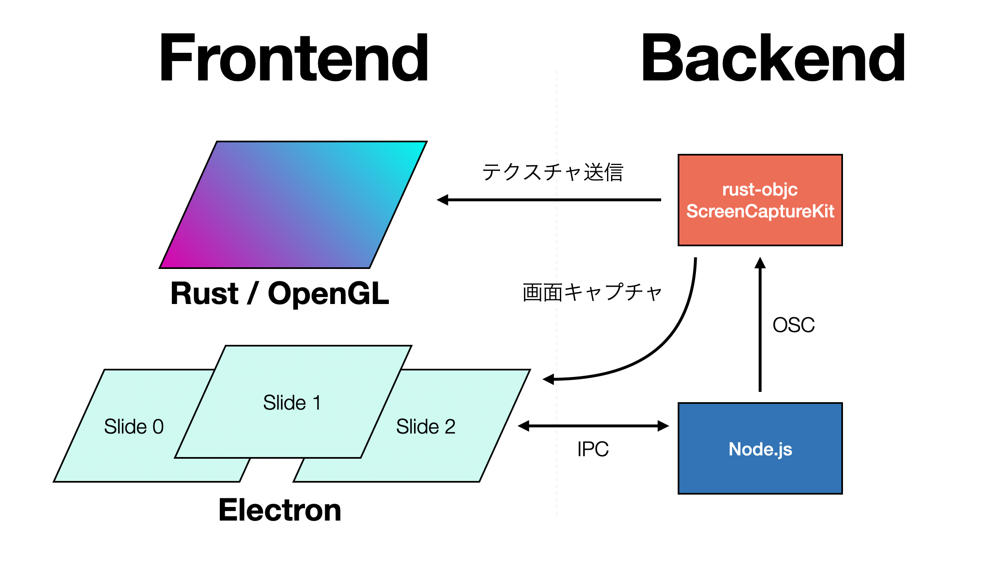

# GLのウインドウを最前面に描画する



```rust
let win = WindowConfig::default()
    .maximized(true)
    .always_on_top(true)
    .mouse_passthrough(true)
    .title("GL!")
    .decorations(false)
    .transparent(true);

notan::init_with(|gfx: &mut Graphics| GLApp::setup(gfx))
    .add_config(win)
    .add_config(DrawConfig)
    .update(Self::update)
    .draw(Self::draw)
    .build()
```

- 最前面に表示して、マウスで触れないようにする
  - 背面にあるElectronのウインドウは操作したいので
- この辺、大体どのGUIライブラリでも一緒ですね
